# Stasis: A distributed, consensus-based blockchain volume ledger

`stasis` is a distributed, eventually consistent, immutable, blockchain-based ledger designed for high-throughput of (as of now) logs on filesystem operations.
By design, `stasis` uses a WAL-based architecture, where each node stores the full chain of blocks, and new blocks are created by appending to the end of the chain.

## But why?

What better way to understand distributed systems than to build one? `stasis` is a learning project, and a playground for exploring distributed consensus algorithms, blockchain data structures, and the challenges of building a distributed ledger.
Now this project is not meant to be a production-ready system, but rather a sandbox for experimentation and learning, i'm thinking of modifying it in a more complete system with actual operations.

## Ok, how does it work?

`stasis` is built on top of a simple blockchain data structure, where each block contains a detailed `JSON` payload that describe: _event_, _path_, _inode_, _size_ and the _content hash_.
Immediately after there is the distributed layer, this part is responsible for maintaining the consistency of the ledger across multiple nodes, and ensuring that all nodes agree on the order of operations also managing deduplication and conflict resolution.

To manage the update of the blockchain, `stasis` uses a raft-based consensus algorithm, where nodes elect a leader to propose new blocks, and followers validate and append the blocks to their local chain.
Every node maintains a copy of the full blockchain, and new blocks are created by appending to the end of the chain, also `stasis` is perfectly capable of handling node failures, network errors, and other common issues that arise in distributed systems.

Nodes can discover each other using a UDP discovery protocol, and they communicate using a simple REST-like HTTP api for block propagation and consensus messages. At the moment the discovery protocol is very basic, it's just a broadcast of the node's address to the local network, but in the future I plan to implement a more robust discovery mechanism that can work across different networks and handle more complex scenarios.

### The architecture

  

1. The **Watchdog**: Filesystem Observation & Smart Hashing

   The Watchdog is a specialized observer thread that hooks into the filesystem to monitor targeted directories for changes to `.qcow2` files (including creations, modifications, deletions, and moves).

   Because virtual machine images and volumes can be massive, attempting to hash the entire file on every tiny write is computationally unfeasible. To solve this, the Watchdog employs a Smart Hashing mechanism utilizing the `BLAKE3` algorithm.

   Files under a configurable size threshold (defaulting to `512 MB`) are completely hashed.
   For files exceeding this threshold, the system reads evenly spaced chunks (by default, 64 samples of 4 MB each). This ensures the hashing overhead is strictly bounded while remaining highly sensitive to mutations across the file's binary footprint.

2. **UDP Discovery**: Dynamic Decentralization

   A major architectural goal of `stasis` was avoiding the fragility of hardcoded node lists. Peer routing is handled seamlessly by the UDP Discovery service.

   Every participating node blasts UDP beacons across the subnet (default port 7000) every few seconds, advertising its Node ID, IP address, and its API port. If a node crashes or leaves the cluster and fails to broadcast a beacon within a Time-To-Live (`TTL`) window (15 seconds by default), it is automatically considered dead and pruned from the network's active memory.

3. The **Blockchain API**: Raft Consensus & the WAL

   The actual web service tying this all together is a `Flask` API that implements a Raft-inspired consensus protocol. Nodes dynamically vote to elect a `Leader`, who assumes the responsibility of coordinating and replicating filesystem events to the rest of the `Followers`.

   If a node crashes, data isn't lost. Before memory structures are even updated, new blocks are persisted locally in an append-only format to the Write-Ahead Log (blockchain.wal). Upon rebooting, the node reconstructs its entire state, block index, and chain length by executing `load_wal()`.

## What problems does it solve?

Imagine this: you have a cluster of independent machines (no not really a cluster....), those machines are running virtual machines, to provide these VMs with storage you opt for a hybrid solution, some of your VMs will use local storage, other will use a distributed file system across the cluster.
Now, keeping track of all the operations for each virtual disk can be a nightmare, especially when you have multiple nodes that can perform operations on the same disk, and you need to ensure that all nodes have a consistent view of the state of the disk.
`stasis` can be used as a distributed ledger to track all the operations performed on the virtual disks, ensuring that all nodes have a consistent view of the state of the disks, and providing a reliable way to recover from failures and conflicts.
For cybersecurity, `stasis` can be used to create an immutable log of all operations performed on a system, providing a tamper-proof record of all activity that can be used for auditing and forensic analysis.

## What's next?

As said earlier, `stasis` is a learning project, and a playground for exploring distributed consensus algorithms, blockchain data structures, and the challenges of building a distributed ledger.
With enough time and effort, `stasis` could be evolved into a more complete system with actual operations, such as creating, deleting, and modifying virtual disks, and providing a more robust discovery mechanism that can work across different networks and handle more complex scenarios.
As a cybersecurity student, `stasis` was developed as a way to keep an immutable and distrubuted log of all the operations performed on a system, providing a tamper-proof record of all activity that can be used for auditing and forensic analysis, but it can be used for other purposes as well, such as tracking changes to a codebase, or providing a distributed ledger for a decentralized application.
